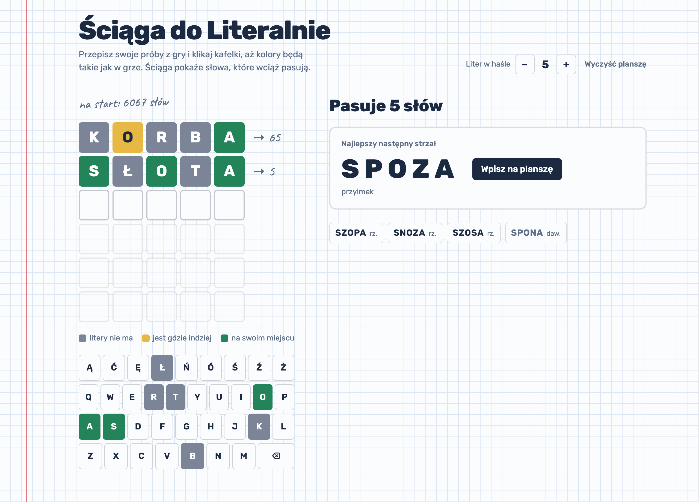

# Ściąga do Literalnie

[](https://github.com/holdegron/literalnie_word_guesser/actions/workflows/ci.yml)


**Przepisz, co pokazała gra. Ściąga powie, co jeszcze pasuje i czym strzelić dalej.**

Pomocnik do polskiego Wordle'a: wpisujesz swoje próby, klikasz kafelki, aż mają te same kolory co w grze,
a z ćwierć miliona polskich słów zostają tylko te, które mogą być hasłem. Najlepszy następny strzał jest na górze.

<picture>
  <source media="(prefers-color-scheme: dark)" srcset="docs/screenshot-dark.png">
  
</picture>

> Ołówkowe dopiski przy wierszach to lejek: **6067** pięcioliterowych słów na start, **65** po KORBIE, **5** po SŁOCIE.

---

## Czym jest Literalnie

[Literalnie](https://literalnie.fun) to polska wersja Wordle'a, która w 2022 roku na chwilę zawładnęła polskim internetem.
Zasady są proste:

- codziennie jest jedno pięcioliterowe hasło i **6 prób**, żeby je zgadnąć,
- każda próba musi być prawdziwym słowem,
- po każdej próbie kafelki zmieniają kolor:

| Kolor     | Znaczenie                                      |
|-----------|------------------------------------------------|
| zielony   | litera jest w haśle **na tym miejscu**         |
| żółty     | litera jest w haśle, ale **w innym miejscu**   |
| szary     | tej litery w haśle **nie ma** (albo już się „skończyła”) |

Polska wersja ma swoje smaczki: `ą ć ę ł ń ó ś ź ż` to osobne litery, więc `ZAPAŁ` i `ZAPAL` to zupełnie różne słowa.

## Co umie ściąga

- **Plansza jak w grze**: piszesz z klawiatury (polskie znaki przez AltGr / Option też działają) albo klikasz ekranową.
- **Kolory klikasz**: szary, żółty, zielony, po kolei. Wynik przelicza się na żywo.
- **Lejek ołówkiem**: przy każdej próbie widać, ile słów zostało. Od razu wiadomo, która próba była dobra.
- **Najlepszy następny strzał**: kandydaci są posortowani tak, żeby kolejna próba odsiała jak najwięcej (szczegóły niżej).
- **Klik w słowo wpisuje je na planszę**, a litery, które już były zielone na tym miejscu, od razu są zielone.
- **Rzadkie i dawne słowa lądują na końcu** (`daw.`, `przest.`, `rzad.`, `gwar.`, `reg.`, `indyw.`), bo hasłem raczej nie będą.
- **Dowolna długość hasła** od 2 do 15 liter, gdyby ktoś grał w wariant z dłuższymi słowami.
- Jasny i ciemny motyw (zeszyt w kratkę za dnia i nocą), działa na telefonie.

## Jak to działa pod maską

### Słownik: SGJP

Słowa pochodzą z [Słownika gramatycznego języka polskiego](https://sgjp.pl) w wersji dla analizatora Morfeusz.
Plik to 7,46 mln wierszy w formacie `forma ⇥ lemat ⇥ znacznik ⇥ kategoria ⇥ kwalifikatory`:

```
kotem   kot:Sm1   subst:sg:inst:m1   nazwa_pospolita   pot.,środ.
kotek   kotek     subst:sg:nom:m2    nazwa_pospolita
```

Przy starcie aplikacja strumieniowo czyta `sgjp.tab.gz` (bez rozpakowywania) i zostawia tylko **formy podstawowe pisane małymi
polskimi literami**. Odpadają nazwy własne, skrótowce, słowa z łącznikiem i odmienione formy. Homonimy (`piec` jako rzeczownik
i jako czasownik) sklejają się w jedno słowo.

| Długość hasła | 4    | 5    | 6     | 7     | 8     | razem (2–30) |
|---------------|------|------|-------|-------|-------|--------------|
| Słów          | 2452 | 6067 | 10449 | 16085 | 22408 | **258 545**  |

Ładowanie trwa ok. 4 s, a cała aplikacja po starcie mieści się w ok. 90 MB sterty (poprzednia wersja trzymała w pamięci
wszystkie 7,4 mln wierszy jako obiekty).

### Cały solver to jedno porównanie

Zamiast budować ręcznie reguły typu „litera X jest, ale nie na pozycji 3, i jest jej co najmniej dwa razy”,
ściąga zadaje jedno pytanie: **gdyby hasłem było słowo W, czy gra pokazałaby dokładnie te kolory?**

```kotlin
data class Guess(val word: String, val marks: List<Mark>) {
    fun admits(answer: String): Boolean = feedback(word, answer) == marks
}
```

`feedback` to wierna kopia tego, jak koloruje gra: najpierw zielone, potem żółte rozdawane od lewej, dopóki w haśle zostały
jeszcze takie litery. Dzięki temu powtórzone litery działają same z siebie, bez żadnych wyjątków w kodzie:

|        | 1     | 2       | 3       | 4     | 5     |
|--------|-------|---------|---------|-------|-------|
| próba  | K     | O       | K       | O     | S     |
| hasło  | S     | O       | K       | Ó     | Ł     |
| kolor  | szary | zielony | zielony | szary | żółty |

Drugie „O” jest szare, bo hasło ma tylko jedno O (a „Ó” to inna litera). Pierwsze „K” też jest szare, bo jedyne K w haśle
zostało już „zużyte” przez zielony kafelek na pozycji 3.

### Lejek: `runningFold`

Liczby ołówkiem obok wierszy to wynik jednego złożenia:

```kotlin
val pools = puzzle.guesses.runningFold(wordsOfLength(puzzle.length)) { pool, guess ->
    pool.filter { guess.admits(it.text) }
}
// pools.map { it.size } == [6067, 65, 5]
```

### Ranking: który strzał odsieje najwięcej

Dla każdego kandydata liczymy, w ilu pozostałych słowach występują jego **różne** litery i w ilu stoją **na tych samych
miejscach**. Słowo o najwyższej sumie najlepiej dzieli resztę puli, niezależnie od tego, jakie kolory dostanie. Powtórzone litery
nie dają punktów drugi raz, a słowa oznaczone w SGJP jako dawne lub rzadkie lądują na końcu. Na start (5 liter) wygrywa **KOLIA**,
tuż za nią NORKA i LORKA.

## Architektura

```
.
├── src/main/kotlin/pl/com/pm/literalnie
│   ├── dictionary/        parsowanie SGJP, model Word, ładowanie słownika (czyste funkcje)
│   ├── solver/            feedback, Guess/Puzzle, lejek i ranking (czyste funkcje)
│   └── web/               jeden kontroler REST, jedyne miejsce, gdzie domena spotyka HTTP
├── src/test/              testy jednostkowe i integracyjny test API na małym wycinku SGJP
├── web/                   frontend: React 19 + Vite 8 + Tailwind 4
│   └── src/
│       ├── game/          stan planszy jako czysty reducer + selektory (z testami)
│       ├── hooks/         useSolver (debounce + AbortController), useKeyboardInput
│       ├── api/           typowany klient /api/solve
│       └── components/    Board, Keyboard, Results
└── build.gradle.kts       zadanie downloadDictionary, bundlowanie frontu do jara
```

Kilka decyzji, które warto znać:

- **Funkcyjny rdzeń, Spring tylko na brzegach.** Logika to niemutowalne `data class` i czyste funkcje (`feedback`, `admits`,
  `solve`, `rankedForNextGuess`), które da się testować bez kontekstu Springa. Spring robi dwie rzeczy: ładuje słownik do beana
  i wystawia endpoint. Bez warstw `Service`/`ServiceImpl`/`Repository` dla zasady.
- **Walidacja w konstruktorach.** `Guess` i `Puzzle` nie dadzą się zbudować z błędnymi danymi (`require` w `init`).
  Kontroler zamienia to na `400` w formacie `application/problem+json`.
- **Front bez bibliotek do stanu.** Plansza to `useReducer` z czystą funkcją `boardReducer`, a wszystko, co widać
  (próby do wysłania, kolory klawiatury), jest z niej wyliczane.
- **Słownik nie siedzi w repo.** Ma 43 MB, więc pobiera go `./gradlew downloadDictionary` z oficjalnego serwera SGJP
  (wersja przypięta w `gradle.properties`).

## Uruchomienie

Wymagania: JDK 17+ do odpalenia Gradle'a (JDK 25 dla aplikacji Gradle pobierze sam przez toolchain) i Node 22.

**Tryb deweloperski**, dwa terminale:

```bash
./gradlew bootRun
```

```bash
npm --prefix web install && npm --prefix web run dev
```

`bootRun` za pierwszym razem pobierze słownik (ok. 43 MB) do `data/sgjp.tab.gz`, potem wystartuje API na `:8080`.
Front działa na [localhost:5173](http://localhost:5173) i przez proxy Vite'a woła `/api`.

**Jeden jar z frontem w środku:**

```bash
npm --prefix web ci && npm --prefix web run build
```

```bash
./gradlew downloadDictionary bootJar
```

```bash
java -jar build/libs/literalnie-1.0.0.jar
```

Całość (UI + API) jest wtedy pod [localhost:8080](http://localhost:8080). Ścieżkę do słownika zmienisz przez
`--literalnie.dictionary.path=...` albo zmienną `LITERALNIE_DICTIONARY_PATH`. Obsługiwany jest zarówno `.tab.gz`, jak i rozpakowany `.tab`.

## API

`POST /api/solve`

```json
{
  "length": 5,
  "guesses": [
    { "word": "korba", "marks": ["ABSENT", "PRESENT", "ABSENT", "ABSENT", "CORRECT"] },
    { "word": "słota", "marks": ["CORRECT", "ABSENT", "CORRECT", "ABSENT", "CORRECT"] }
  ],
  "limit": 3
}
```

```json
{
  "total": 5,
  "funnel": [6067, 65, 5],
  "words": [
    { "text": "spoza", "partsOfSpeech": ["PREPOSITION"], "qualifiers": [], "rare": false },
    { "text": "szopa", "partsOfSpeech": ["NOUN"], "qualifiers": [], "rare": false },
    { "text": "snoza", "partsOfSpeech": ["NOUN"], "qualifiers": [], "rare": false }
  ]
}
```

- `marks`: `ABSENT` (szary), `PRESENT` (żółty), `CORRECT` (zielony)
- `limit`: domyślnie 200, maksymalnie 5000; `total` zawsze mówi, ile słów pasuje naprawdę
- `funnel`: liczba kandydatów przed pierwszą próbą i po każdej kolejnej
- błędne dane (np. próba o złej długości) zwracają `400` z opisem w polu `detail`

## Testy

```bash
./gradlew test
```

```bash
npm --prefix web run lint && npm --prefix web test
```

Backend testuje kolorowanie (z powtórzonymi literami), parsowanie SGJP, lejek i ranking oraz całe API na małym wycinku
prawdziwego słownika. Front testuje reducer planszy i polską odmianę („1 słowo”, „3 słowa”, „5 słów”, „22 słowa”). CI odpala
jedno i drugie przy każdym pushu.

## Licencje

- Kod: [MIT](LICENSE).
- Dane słownikowe: **SGJP** © Zygmunt Saloni, Włodzimierz Gruszczyński, Marcin Woliński, Robert Wołosz, Danuta Skowrońska
  i inni, na [licencji BSD-2-Clause](https://morfeusz.sgjp.pl/doc/license/). Repozytorium zawiera tylko kilkadziesiąt wierszy
  słownika jako dane testowe (`src/test/resources/sgjp-sample.tab`, razem z oryginalną notą licencyjną). Pełny plik jest
  pobierany z [download.sgjp.pl](https://download.sgjp.pl/morfeusz/).
- To nieoficjalny projekt, niezwiązany z twórcami gry Literalnie.
